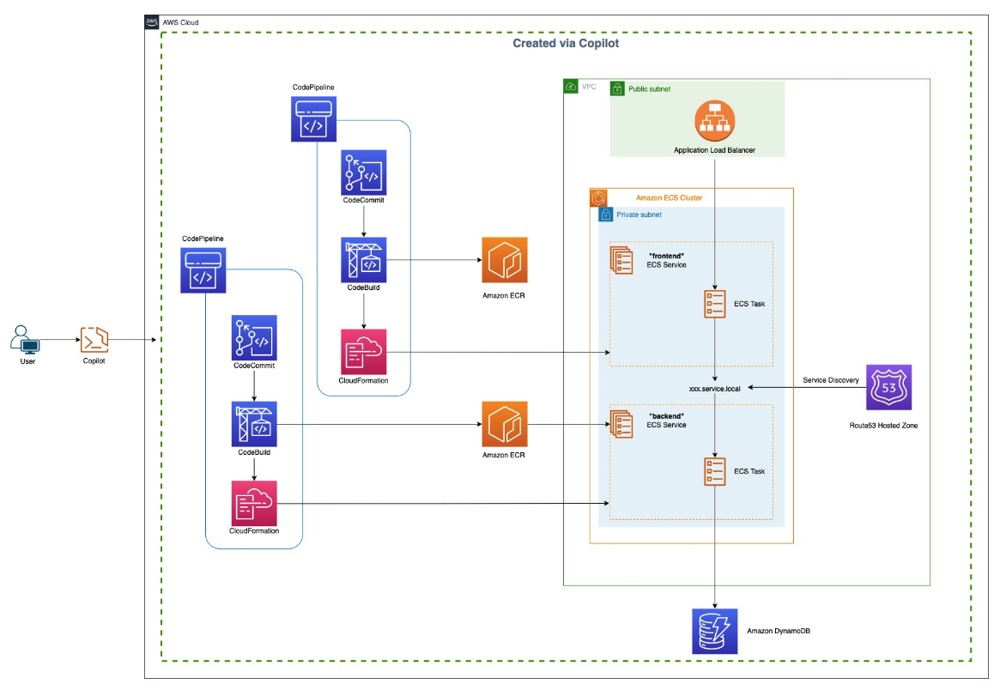

# 📝 Building an Automated CI/CD Pipeline Architecture to Connect Microservices with AWS Copilot

## 🌐 Project Overview

This project demonstrates how to build a **Task Management Application** deployed using **AWS Copilot CLI** for **CI/CD pipelines** and **containerized services**. The CI/CD pipelines utilize **AWS CodePipeline**, **CodeCommit**, **CloudFormation**, and **Amazon ECS** to automate the process of code commit to deployment.

The application architecture is designed to be **scalable**, **resilient**, and **fully automated** from code changes to production deployments using AWS managed services.

### 🖼️ Architecture Diagram

---

## 🛠️ Technologies Used

### ✅ CI/CD and Infrastructure

- **AWS Copilot CLI**  
  - Defines and manages the application's infrastructure using **Infrastructure as Code (IaC)**.
  - Automatically provisions environments, ECS services, and CI/CD pipelines for both frontend and backend.

- **AWS CodePipeline**  
  - Automates the build, test, and deployment stages whenever there is a code change.
  - Integrated with **AWS CodeCommit** for version control and **Amazon ECS** for containerized deployment.

- **AWS CodeCommit**  
  - Hosts Git repositories for the application's source code.
  - Integrated with **AWS CodePipeline** to trigger build and deployment on code commits.

- **AWS CloudFormation**  
  - Manages and provisions the infrastructure as a set of templates.
  - Ensures consistent and repeatable environment creation.

- **Amazon ECS (Elastic Container Service)**  
  - Deploys and manages containerized applications on a cluster of virtual servers.
  - Handles service discovery, task management, and scaling of application containers.

- **Docker**  
  - Containerizes application services for consistent and isolated execution environments.
  - Ensures that the application runs the same in any environment.

- **IAM (Identity and Access Management)**  
  - Manages permissions and access for AWS services.
  - Configures roles and policies for secure access control.

---

### ✅ Application and Database

- **AWS DynamoDB**  
  - NoSQL database service used to store **todo tasks**.
  - Fully managed, with auto-scaling and provisioned throughput to handle varying load.

- **Amazon VPC (Virtual Private Cloud)**  
  - Creates an isolated network environment for application services.
  - Configures private subnets, security groups, and routing for secure resource communication.

- **AWS Systems Manager Parameter Store**  
  - Stores configuration settings and environment variables for deployed applications.
  - Ensures secure storage and management of application secrets.

- **Amazon CloudWatch**  
  - Monitors the health and performance of ECS services and clusters.
  - Provides log aggregation, custom metrics, and dashboards for real-time monitoring.

---

### 🔧 ECS Task Configuration

- **Dockerfile**  
  - Defines how the application should be packaged in a Docker container.
  - Includes dependencies, build steps, and environment settings.

- **AWS Copilot Configuration**  
  - Manages deployment to ECS using Copilot's **manifest file**.
  - Defines containerized service details, scaling options, and networking configurations.

---

## 📈 Key Features

- **Fully Automated CI/CD Pipeline**  
  - Code changes trigger automatic builds, tests, and deployments using **AWS CodePipeline**.

- **Containerized Application**  
  - Backend and frontend services run in isolated Docker containers managed by **Amazon ECS**.

- **Highly Scalable**  
  - ECS services can scale based on load using **Auto Scaling** and **Elastic Load Balancing**.

- **Fully Managed NoSQL Database**  
  - **AWS DynamoDB** handles task storage with automatic scaling and high availability.

- **Infrastructure as Code**  
  - **AWS Copilot CLI** provisions all infrastructure, including the ECS services and CI/CD pipeline.

- **Centralized Monitoring**  
  - **Amazon CloudWatch** provides centralized logging, metrics, and health monitoring for application components.

---

## 📬 Contact

For questions, feel free to reach out or open an issue.  
Happy coding! 🚀

**Le Nguyen Phuc Loc**  
*DevOps Engineer*  
📧 phuclocdh2017@gmail.com
